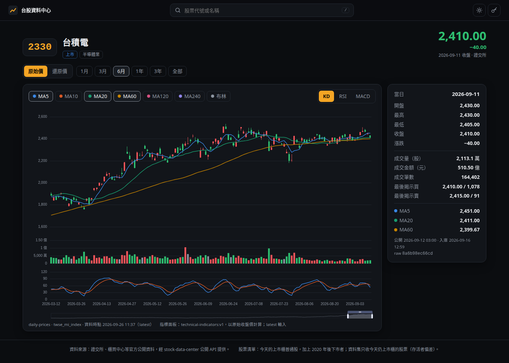
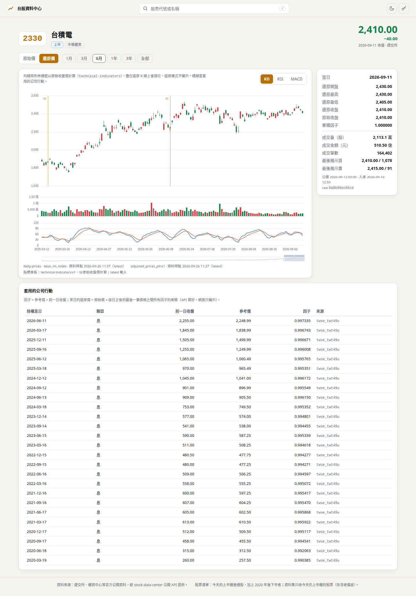
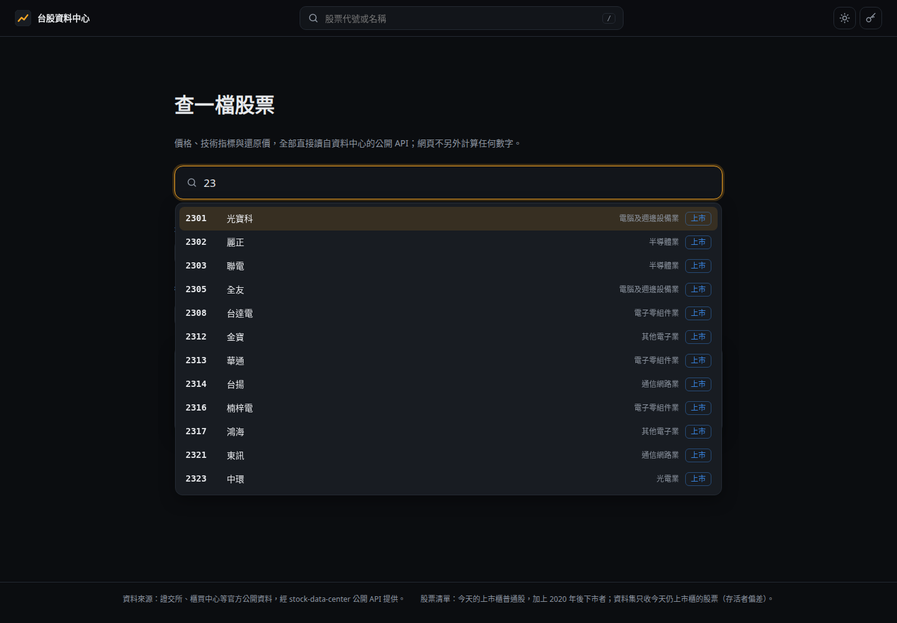
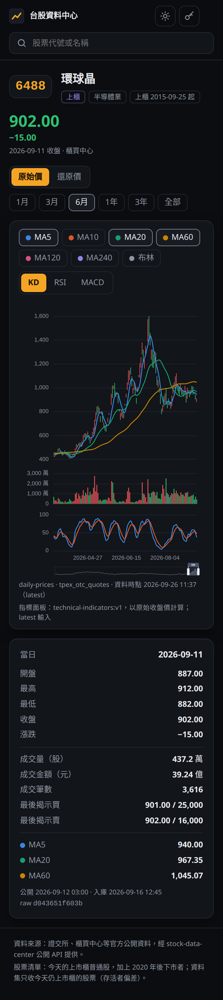
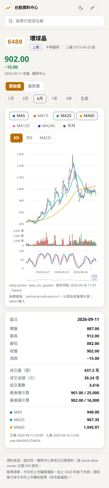

# Step 37-a 驗收報告

狀態：IN REVIEW (#69)

範圍：網頁儀表板的骨架（ROADMAP Step 37、ADR-0029）。`api` 容器在 `/` 同源提供一個 React + ECharts 的網頁，只透過公開 API
讀資料：股票搜尋、個股頁的 K 線＋成交量＋均線＋KD／RSI／MACD、原始價／還原價切換、白天／黑夜主題（預設黑夜）。

## 交付

| | 內容 |
|---|---|
| `docs/decisions/0029-web-dashboard.md`（新） | 框架、圖表庫、提供方式、key、測試工具、前端不計算、來源不合併 |
| `src/stock_data_center/api/__init__.py`、`__main__.py` | `create_app(web_dir=...)`、`STOCKDC_WEB_DIR`：`/` 與 `/assets/*` 不需 key；`index.html` 回 `no-cache` |
| `Dockerfile`、`.dockerignore` | 多階段建置：`node:22-slim` 建置網頁，Python 映像只帶 `web/dist`（`/app/web`） |
| `web/`（新） | `src/lib/`：純函式（`series` 對齊交易日、`chart` 產生 ECharts 選項、`movement` 漲跌方向、`format`、`search`）；`src/api/` 型別與 client；`src/pages/`、`src/components/` |
| `scripts/verify_web.sh`（新） | 建置、在本機回環位址以臨時 key 提供網頁與 API、跑 Playwright；結束時殺整個 process group 並確認無殘留 |
| 測試 | `tests/unit/test_api_web.py`（15）；`web/tests/`（Vitest 42）；`web/e2e/dashboard.spec.ts`（Playwright 9） |
| 文件 | ADR-0029、CLAUDE.md §2 與快照、ROADMAP（§20、Step 36 狀態、Step 37）、`docs/api.md`、README |

`src/` +30／−8 行；`web/src` 約 1,600 行（TypeScript、TSX、CSS）。沒有 migration、沒有新 API 端點。

## 設計重點

- **前端不計算**：圖上每個值是某個 API 回應的欄位。只做顯示格式（千分位、萬／億、兩位小數、台北時間）。漲跌幅百分比 API 沒有，就不顯示。
- **缺值不畫成 0**：K 線與柱狀圖用 `"-"`、折線用 `null` 且 `connectNulls: false`；x 軸是 `/v1/trading-days`，停牌的日子留空位。
  價格日期若不在交易日曆上，仍畫在軸上並顯示警告，不丟棄。
- **還原價**：畫 `adjusted-prices-pit` 的 `adjusted_*_price`，網頁不自己乘因子；套用的事件以直線標在除權息日並列表。
  均線與布林以原始收盤價計算（`technical-indicators` 的 `price_adjustment_convention`），疊在還原 K 線上會錯位，所以還原模式隱藏，並寫明原因。
- **來源不合併**（§30）：一檔股票有兩個價格來源（5236 在 2026-07-16 由上櫃轉上市）時出現來源切換，預設最新一筆的來源。
- **漲跌方向**：兩個來源的 `price_change` 都帶正負號；TPEx 沒有方向欄，只有不比價 `X`。只看 `price_direction` 的第一版讓 6488 的漲跌
  少了負號（−15 顯示成 15.00）、櫃買股的成交量柱全是灰色——截圖發現、先補紅測試再修（`web/src/lib/movement.ts`）。不比價的日子不著紅綠。
- **配色**：均線用驗證過的類別色第 1–5、7 格（第 6 格綠、第 8 格紅保留給跌、漲）。`validate_palette.js`：深色全部通過；淺色三格對底色
  低於 3:1，依規則以可見的標籤補償——均線按鈕即圖例，當日面板以文字列出每條均線的值。

## 驗收標準

| 標準 | 結果 | 證據 |
|---|---|---|
| 每個面板對真實股票（2330、6488），畫出來的值等於同一個 API 回應 | **PASS** | Playwright 從頁面的 ECharts 實例讀回每個 series，與測試自己用同一把 key 取得的 API 回應**逐點**比對整段歷史（2020-01-02 起）。見下表 |
| 缺值與沒有來源的欄位不被畫成數字 | **PASS** | Vitest：沒有列、值為 NULL 的日子為 `"-"`／`null`，成交量 0 照畫 0；因子未知的還原日為空。e2e：每個 API 日期都在軸上（沒有列被丟掉），沒有列的格子一律為空 |
| 深淺兩種主題與手機寬度要人眼確認 | **截圖已附，owner 尚未確認** | 下方截圖由 Playwright 產生，我看過；e2e 驗證手機（390px）沒有水平捲動 |
| 從另一台電腦經區網與 Tailscale 打開頁面可用 | **尚未驗證** | 需要部署（`scripts/api_up.sh`）後由人在另一台電腦開 `http://172.16.7.57:28617/` 與 `http://100.69.117.102:28617/`。本機已用建好的映像在 `127.0.0.1:28699` 驗過：`/` 200 且 `no-cache`、asset 200、`/v1/stocks` 無 key 401、有 key 200 |

### 逐點比對（`scripts/verify_web.sh`，stockdc_backfill，2026-09-26）

| 股票 | 模式 | 交易日 | 有值的 K 棒 | 空格 | API 列數 | 另外比對的 series |
|---|---|---|---|---|---|---|
| 2330 | 原始 | 1,627 | 1,627 | 0 | 1,627 | 成交量、MA5/20/60/240、布林三軌、K、D、RSI6/12、MACD DIF/DEA/柱 |
| 2330 | 還原 | 1,627 | 1,627 | 0 | 1,627 | 26 個事件的標線與表格列 = API `events` |
| 6488 | 原始 | 1,627 | 1,627 | 0 | 1,627 | 同 2330 |
| 6488 | 還原 | 1,627 | 1,627 | 0 | 1,627 | 13 個事件 |
| 5236 | 兩個來源各自 | — | — | — | — | 各來源的 K 線只含該來源的列；軸的首尾 = 該來源首尾日期；還原價可開啟 |

其餘 e2e：沒有 key 時先問 key、輸入後可搜尋並進個股頁；錯的 key 被拒並重問；主題預設黑夜、切換後重新整理仍保留。

```text
Running 9 tests using 1 worker
  ✓  1 the page asks for the key and serves no data without one
  ✓  2 2330: raw candles, volume, averages and indicators equal the API
  ✓  3 2330: adjusted candles and their events equal the API
  ✓  4 6488: raw candles, volume, averages and indicators equal the API
  ✓  5 6488: adjusted candles and their events equal the API
  ✓  6 5236: two price sources are shown apart, never merged
  ✓  7 the theme toggles, is remembered, and defaults to dark
  ✓  8 a wrong key is refused and asked again
  ✓  9 screenshots for the owner: both themes, desktop and phone
  9 passed (57.4s)
```

### 其他檢查

| 檢查 | 結果 |
|---|---|
| `.venv/bin/pytest -q` | 1003 passed |
| `web`: `npm test`（Vitest） | 42 passed |
| `web`: `npm run build`（`tsc --noEmit` + `vite build`） | 通過；bundle 829 KB（gzip 275 KB），全部打包、不載入外部資源 |
| `docker compose build api` | 通過；映像不含 node，只含 `/app/web` |
| TDD | Python 15 條與 Vitest 各檔都先紅（模組不存在／行為不符）再綠；`movement` 的 TPEx 案例在修正前紅 |

## 截圖







| 手機 黑夜 | 手機 白天 |
|---|---|
|  |  |

## Code review 修正（#69）

| 發現 | 判斷 | 回核 | 修正 |
|---|---|---|---|
| 切換主題後圖表顏色慢一拍 | 成立 | 新 e2e 先紅：切到淺色後 K 線仍是深色的 `#f0555a`（應為 `#d63a3a`） | `useTheme` 的切換先同步改 `<html data-theme>` 再 re-render |
| 沒有價格的股票在還原模式永遠「載入中」 | 成立 | 新 e2e 先紅：1258（已下市、清單有、資料集無）在還原模式出現「載入中…」 | 沒有價格來源就不等還原價 |
| `verify_web.sh` 可能在 setsid 生效前讀到自己的 process group | 理論上成立 | 非互動腳本 200 次都沒碰上，但碰上時會殺掉呼叫者的整個 group | 等到 launcher 成為自己的 group leader 才繼續，否則中止；`verify_api.sh` 同一段一併修 |

同時修進腳本：這個 session 的 PATH 沒有 nvm 裝的 node，`verify_web.sh` 在 `npm` 不在 PATH 時載入 `~/.nvm/nvm.sh`。
修正後：`verify_web.sh` 10 passed（多了上面兩條回歸）、Vitest 42 passed、`tsc` 通過、`verify_api.sh` failures 0。

## 已知限制

- `stockdc_backfill` 的價格到 2026-09-11 為止（前向抓取是 Step 28），所以「最新」是那天。
- 區網是明文 HTTP，key 在線路上是明文（與 API 相同）；經 Tailscale 加密。
- 還原模式下 KD／RSI／MACD 仍是原始收盤價算的，面板標明；還原價版本的指標要等消費者需要（CLAUDE.md §80）。
- 一次載入整段歷史（單檔約 1 MB JSON、0.1–0.2 秒）；資料變多時再考慮分段。

## 延後

- 37-b：籌碼、市場頁（指數與法人彙總）。37-c：月營收、財報重點、官方與計算的估值、公司行動列表。
- 歷史時間點選擇器不在 Step 37。
