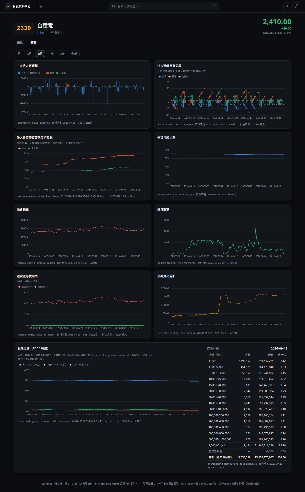
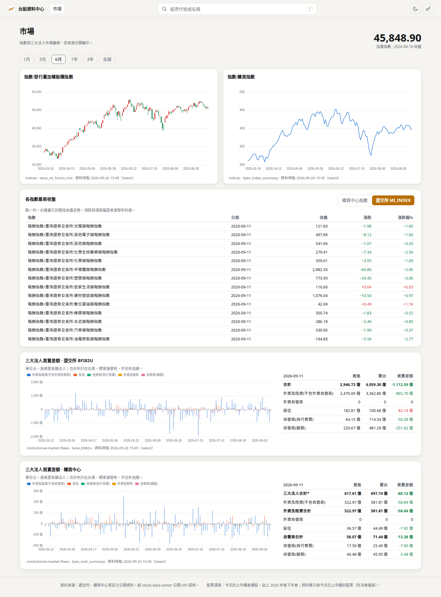
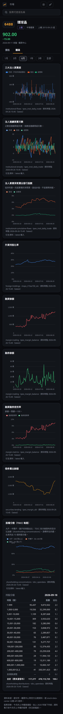

# Step 37-b 驗收報告

狀態：IN REVIEW

範圍：網頁儀表板的籌碼與市場頁（ROADMAP Step 37、ADR-0029）。個股頁多一個「籌碼」分頁，新增「市場」頁；
API 的 `indices` 多一個可重複的 `index_name` 篩選參數（owner 2026-09-26 決定）。37-a 狀態改為 MERGED（#69）。

## 交付

| | 內容 |
|---|---|
| `src/stock_data_center/v2/visibility.py` | `rows(index_names=...)`：在查詢條件裡篩選；沒有 `index_name` 欄的表拒絕 |
| `src/stock_data_center/api/__init__.py`、`openapi.py` | `indices` 接受可重複的 `index_name`，回應的 `query` 帶出；其他資料集照舊 400；Swagger 說明 |
| `web/src/lib/`（新） | `panel.ts` 通用時間序列面板、`chips.ts` 籌碼面板與 TDCC 分級表、`market.ts` 指數與法人彙總、`exchange.ts` 來源對應交易所；`router.ts` 加分頁與市場頁 |
| `web/src/pages/ChipsTab.tsx`、`MarketPage.tsx`（新）、`components/PanelChart.tsx`、`PitNote.tsx`（新） | 籌碼分頁、市場頁、共用縮放與游標的面板元件 |
| 測試 | `tests/integration/test_api_observed.py` +3、`tests/unit/test_api_openapi.py`；Vitest 69（+27）；Playwright 16（+5） |
| 文件 | ROADMAP（§20、Step 37 的 37-a／37-b）、CLAUDE.md 快照、`docs/api.md`、README、37-a 報告狀態 |

`src/` +25／−6 行；`web/src` 新檔約 800 行、既有檔 +335／−38。沒有 migration。

## 為什麼加 `index_name`

`indices` 沒有股票，只能依來源整批查：

| 請求（2000-01-01 起） | 回應 | 列數 | 時間 |
|---|---|---|---|
| `source=twse_mi_index` | 49.7 MB | 111,987 | 6.4 秒 |
| `source=tpex_index_summary` | 29.5 MB | 70,732 | 4.0 秒 |
| `index_name=指數/臺灣證券交易所:發行量加權股價指數` | 0.73 MB | 1,627 | 0.12 秒 |
| `index_name=指數:櫃買指數` | 0.67 MB | 1,627 | 0.16 秒 |

它只縮小查詢，不改變任何一列的可見性（篩選在 PIT 選列之前、只作用在 key 上），不是新端點也不是計算。

## 設計重點

- **籌碼分頁**：八個每日面板共用一條交易日曆 x 軸（`echarts.connect`，縮放與游標連動），各自一個 y 軸：
  三大法人買賣超、連續買賣天數、累積淨買賣佔發行股數、外資持股比率、融資餘額、融券餘額、融資融券使用率、借券賣出餘額。
  兩個尺度差很多的量（融資與融券餘額）分成兩個面板，不用第二條 y 軸。
- **股權分散**：大戶（400 張以上）／中實戶／散戶佔比的週線；游標所在週的 15 個分級表，分級文字取自 TDCC 集保戶股權分散表查詢頁
  （legacy scraper 以同一組字串對應分級號），差異數調整（有正負號）與合計照來源發布。
- **市場頁**：加權指數 K 線（`twse_mi_5mins_hist`，只有它有開高低）；選定指數的收盤走勢，預設櫃買指數；各指數最新收盤表，
  點一列即畫它；證交所與櫃買中心的三大法人買賣差額各自一個面板。
- **不合併、不加總**：籌碼資料集依選定的交易所分開（5236 轉市場）；法人彙總的合計列只在表中，不畫成長條；同一類法人在兩個交易所同色，
  遇到沒見過的名稱就拒絕，不猜顏色。
- **單位**：股數與元照 `docs/schema.md`；衍生資料集標「latest 輸入」；累積淨買賣標明「是估計值，不是實際持股」。

實作中發現：

- 加權指數在兩個來源的名稱不同：`twse_mi_5mins_hist` 是 `指數:發行量加權股價指數`，`twse_mi_index` 是
  `指數/臺灣證券交易所:發行量加權股價指數`。原本寫死一個名稱，加權指數的圖就是空的；改成只以來源查 5mins（它只發布這一個指數）。
- 各指數最新收盤表原本取「今天往前 14 天」，但資料到 2026-09-11（前向抓取是 Step 28），表是空的；改成以加權指數最後一筆日期往前 31 天。
- 5236 的證交所籌碼軸比法人資料早一天：轉市場前一晚，兩個交易所的借券表都列出該股（audit Step 21-b）。軸涵蓋該交易所所有資料集的日期，
  那天在法人面板是空格，不是另一個交易所的值。

## 驗收標準

| 標準 | 結果 | 證據 |
|---|---|---|
| 每個面板對真實股票（2330、6488），畫出來的值等於同一個 API 回應 | **PASS** | Playwright 從頁面的 ECharts 實例讀回每個 series，對 API 逐點比對整段歷史：每檔 8 個面板共 22,778 個每日點、376 週的股權分散三條線、最新一週 15 個分級的人數／股數／佔比與合計股數 |
| 市場頁的值等於 API | **PASS** | 加權指數 K 線（開高低收）、櫃買指數、點選後的 `指數/臺灣證券交易所:發行量加權股價指數`、兩個法人彙總的每類法人買賣差額逐點相等；長條的機構正好是來源發布的非合計列 |
| 缺值與沒有來源的欄位不被畫成數字 | **PASS** | Vitest：沒有列、值為 NULL 為 `"-"`／`null`，0 照畫；e2e：每個 API 日期都在軸上，沒有列的格子為空 |
| 多來源不合併 | **PASS** | 5236：切換證交所／櫃買中心，法人面板只含該交易所的列 |
| `index_name` 只縮小查詢 | **PASS** | 整合測試：兩個名稱只回那兩個指數、名稱不存在回空、其他資料集 400；e2e 對真實資料 |
| 深淺主題與手機寬度人眼確認 | **截圖已附，owner 尚未確認** | 手機（390px）的籌碼分頁沒有水平捲動（e2e）；股權分散表在卡片內可橫向捲動 |

### 其他檢查

| 檢查 | 結果 |
|---|---|
| `.venv/bin/pytest -q` | 1006 passed |
| `web`: Vitest | 69 passed |
| `web`: `npm run build` | 通過；bundle 872 KB（gzip 287 KB） |
| `scripts/verify_web.sh` | 16 passed，結束後無殘留伺服器 |
| TDD | `index_name` 的兩條整合測試與 openapi 測試先紅；Vitest 的 router／exchange／panel／chips／market 各檔先紅（模組不存在或行為不符）。「只有 indices 收 index_name」本來就是 400，留作防回歸 |

## 截圖

## 已知限制

- 資料到 2026-09-11（加權指數 5mins 到 09-16），前向抓取是 Step 28。
- 籌碼分頁一次載入七個資料集的整段歷史（每檔約 5 MB JSON，並行約 0.4 秒）。
- 各指數最新收盤表取加權指數最後一筆日期往前 31 天；某個指數若超過一個月沒有資料，就不會出現在表中。

## 延後

- 37-c：月營收、財報重點、官方與計算的估值、公司行動列表。
