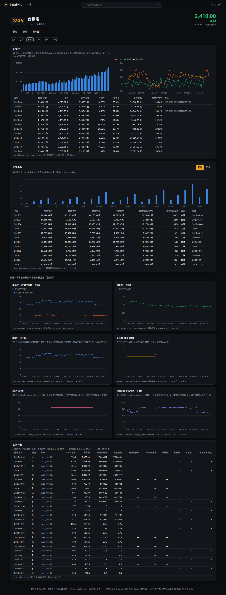
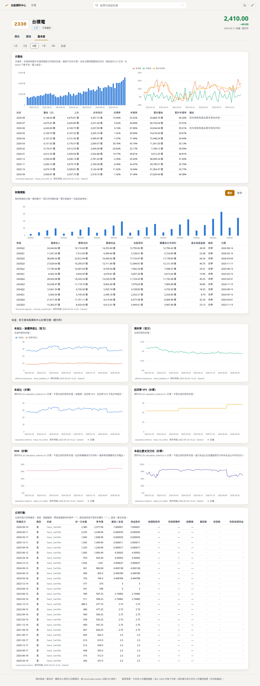

# Step 37-c 驗收報告

狀態：IN REVIEW (#71)

範圍：網頁儀表板的基本面（ROADMAP Step 37、ADR-0029）。個股頁多一個「基本面」分頁：月營收、財報重點、官方與計算的估值、
公司行動。沒有 API 或 Python 的改動。37-b 狀態改為 MERGED（#70）。

## 交付

| | 內容 |
|---|---|
| `web/src/lib/fundamentals.ts`（新） | 月份軸與月營收面板、財報自己那一期的科目值（累計／單季）、估值面板（官方與計算分開）、公司行動的儲存格分類 |
| `web/src/pages/FundamentalsTab.tsx`（新） | 基本面分頁 |
| `web/src/lib/router.ts`、`exchange.ts`、`panel.ts`、`api/client.ts`、`api/types.ts`、`pages/StockPage.tsx` | `#/stock/<id>/fundamentals`、估值與月營收來源對應交易所、「倍」與「元」單位、五個資料集的請求 |
| 測試 | Vitest 79（+10）；Playwright 20（+3） |
| 文件 | ROADMAP（§20、Step 37）、CLAUDE.md 快照、README、37-b 報告狀態 |

`src/` 沒有改動；`web/src` 新檔約 420 行、既有檔 +87／−6。

## 設計重點

- **月營收**：月營收長條、年增率／月增率／累計年增率的折線，全是公司發布的值；x 軸是第一筆到最後一筆之間的每個月，沒有公開時間證明的
  月份（例如部分 KY 公司，在 latest 下看不到）留空。表列最近 12 個月，含上月、去年同月、累計與備註。
- **財報重點**：只請求損益表的六個科目（單檔整段歷史約 120 KB）。每份財報取**自己那一期**的事實：累計是當年 1 月 1 日到季底，
  單季是那三個月；報告裡的上一年比較數字不當成上一年的值。第四季的年報只申報全年，所以單季的第四季留空並寫明，網頁不以全年減前三季自己算；
  預設「累計」，每一季都有申報值。同一科目同一期間出現兩個不同值就拒絕，不挑一個。
- **估值**（CLAUDE.md §53）：官方的本益比／股價淨值比、殖利率，與資料中心計算的本益比、近四季 EPS、ROE、本益比歷史百分位，各自一個面板，
  標題標明「官方」或「計算」，計算的面板附 API 回傳的 `valuation_metrics:v1` 定義。六個面板共用縮放與游標。
- **公司行動**：每一筆事件照來源發布的條件、完整位數（配股率最多十二位小數）；API 省略的欄位（來源不發布）顯示「·」，這一筆為 NULL 顯示「—」。
- **金融業**：沒有財報時寫明「金融業的財報不在 v1 範圍（Step 23）」，其他資料照常顯示。

## 驗收標準

| 標準 | 結果 | 證據 |
|---|---|---|
| 每個面板對真實股票（2330、6488），畫出來的值等於同一個 API 回應 | **PASS** | Playwright 逐點比對：月營收 80 個月的營收與三個比率、26 份財報的 EPS（累計與單季；單季第四季為空）、六個估值面板（官方 1,627 天、計算 1,328 天）、公司行動表的每一筆（2330 27 筆、6488 13 筆） |
| 缺值與沒有來源的欄位不被畫成數字 | **PASS** | Vitest：缺的月份、財報沒有的科目、單季第四季為 null；公司行動來源不發布的欄位與 NULL 分開 |
| 官方估值與計算估值分開標示 | **PASS** | Vitest：兩者在不同面板、各自的資料集；e2e 各自對 `official-valuations` 與 `valuation-metrics` |
| 金融業不像壞掉 | **PASS** | e2e：2881 的財報區塊寫明原因，月營收照常 |
| 深淺主題人眼確認 | **截圖已附，owner 尚未確認** | 下方截圖 |

### 其他檢查

| 檢查 | 結果 |
|---|---|
| `.venv/bin/pytest -q` | 1006 passed |
| `web`: Vitest | 79 passed |
| `web`: `npm run build` | 通過；bundle 886 KB（gzip 291 KB） |
| `scripts/verify_web.sh` | 19 passed（截圖 1 條在沒有設截圖目錄時跳過；設了之後也通過），結束後無殘留伺服器 |
| TDD | `fundamentals.test.ts` 先紅（模組不存在），router 的基本面分頁與 exchange 的估值／月營收來源先紅 |

## 截圖

## 已知限制

- 財報只顯示損益表的六個科目；資產負債表與現金流量表的科目要等使用者需要再加。
- 累計的定義假設會計年度是曆年（台灣上市櫃公司皆是）；若不是，那一季的累計會留空，不會顯示錯的值。
- 期間按鈕（1 月–全部）只控制估值面板；月營收預設顯示最近 5 年、EPS 顯示全部季度。

## 延後

- Step 37 到此完成三個子步驟。之後是 Step 38-b（下市公司的各資料集），再來 Step 28。
